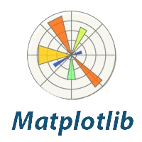
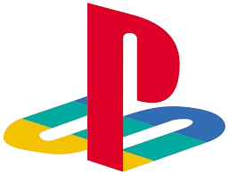

# 😊​ Hi guys my name is Francisco Galvan!

**I'm passionate about programming, video game design, automation, and tool development — and I'm a huge video game enthusiast!**

# 💫 About Me:
- ​​👨‍🎓 I've just finished my Bachelor's Degree in Videogame Development in __Complutense University of Madrid__
- 💼 I'm currently looking for working options as a __Software Developer__.
- 🗂️ Visit my portfolio to see what I've worked on: https://ciscogalvan.github.io/

# 🌐 Socials:

    

# 🔤 Programming Languages:

  
  
  
  
  
  
  
  

# 💻 Tech Stack:

# 📊 GitHub Stats:

 
 

## 🔝 Some Repos

## 📈 Contribution Activity Graph

<!-- Proudly created with GPRM ( https://gprm.itsvg.in ) -->